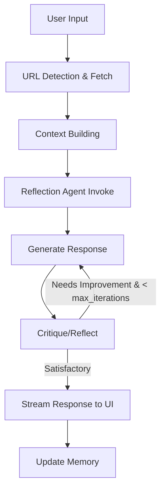

[](https://www.python.org/downloads/)
[](https://github.com/dziduchm/basic-reasoning-agent-local-llm-with-streamlit-ui/actions)
[](https://opensource.org/licenses/MIT)
[](https://streamlit.io/)

# Reflective Reasoning Agent

A Streamlit-powered web application featuring an AI agent that uses reflective reasoning (generate → critique → regenerate) to process user queries. Built with LangChain and LangGraph, it handles text input, detects and fetches URLs, performs free web searches via DuckDuckGo, and supports multiple LLMs (e.g., Grok from xAI, local models via LM Studio Ollama, or OpenAI). Ideal for developers, researchers, or anyone building interactive AI assistants without paid APIs.

The agent dynamically invokes tools based on context, reflects on its outputs for improvement (up to configurable iterations), and streams responses in real-time. Memory is managed conversationally, with truncation for efficiency.

**Target Audience**: Beginners exploring agentic AI (easy setup via Streamlit/Docker) to advanced users customizing LLMs, prompts, or workflows.

## Features
- **Reflective Reasoning Loop**: Generates responses, critiques for accuracy/completeness, and regenerates if needed (up to `max_iterations` in config).
- **Tool Integration**:
  - URL Detection & Fetching: Automatically extracts and loads content from URLs (with 10KB limit, timeouts, and error handling).
  - Free Web Search: Uses DuckDuckGo for up to 5 results; reasoned invocation (e.g., "Do I need to search?").
- **LLM Flexibility**: Supports Grok (xAI API), local models (e.g., via OpenAI-compatible endpoint like LM Studio, Ollama), or OpenAI. Streaming enabled for real-time UI updates.
- **Conversation Memory**: Stores chat history in Streamlit session state; auto-truncates if exceeding token limits; clear button for reset.
- **Performance Optimizations**: In-memory caching for tools/LLMs; lightweight agents; async streaming.
- **Modular Design**: Separate agents for reflection, search, and fetching; versioned prompts for easy updates.
- **Production-Ready**: Docker deployment, Poetry dependencies, pre-commit hooks, unit tests (pytest), and CI via GitHub Actions.
- **Error Handling**: Graceful fallbacks (e.g., invalid URLs show user-friendly errors); custom exceptions.

### Architecture Overview
The core workflow uses LangGraph for a stateful graph:



## Installation

### Prerequisites
- Python 3.12+ (tested on Windows 11, Linux; Windows via WSL recommended).
- Git for cloning.
- Optional: Docker for containerized runs; Poetry for dependency management (install via `pip install poetry`).
- API Keys: For Grok (xAI), set `XAI_API_KEY` in `.env`; for OpenAI, `OPENAI_API_KEY`. Local models need no keys (dummy "lm-studio").

### Step-by-Step Setup
1. **Clone the Repository**:
   ```bash
   git clone https://github.com/dziduchm/basic-reasoning-agent-local-llm-with-streamlit-ui.git
   cd basic-reasoning-agent-local-llm-with-streamlit-ui
   ```

2. **Install Dependencies** (using Poetry):
   ```bash
   poetry install  # Installs runtime + dev deps (tests, linting)
   ```
   - If you prefer pip: `pip install -r requirements.txt` (generate via `poetry export -f requirements.txt --output requirements.txt`).
   - Pre-commit hooks: `pip install pre-commit && pre-commit install` (runs on commits for linting/formatting).

3. **Set Up Environment**:
   - Copy the example env file: `cp .env.example .env`.
   - Edit `.env` with your keys (e.g., `XAI_API_KEY=your_key`).
   - Edit `config.yaml` for your setup (e.g., `model_type: grok`, `model_name: grok-4-fast-reasoning` for xAI).

4. **Install Pre-commit Hooks** (Development Only):
   ```bash
   pre-commit install
   ```
   This ensures Black formatting, Flake8 linting, and basic checks on commits.

For local LLM setup (e.g., LM Studio):
- Download/run LM Studio, load a model (e.g., Llama 3), start the OpenAI-compatible server on `http://localhost:1234/v1`.
- Set `model_type: local` and `endpoint: http://localhost:1234/v1` in `config.yaml`.

## Usage

### Running Locally
1. Start the Streamlit app:
   ```bash
   poetry run streamlit run main.py
   ```
   - Opens at `http://localhost:8501`.
   - Chat interface: Enter text (e.g., "Explain quantum computing from https://en.wikipedia.org/wiki/Quantum_computing").
   - The agent detects URLs, fetches content, searches if needed, and responds with reflection.

2. **Example Interactions**:
   - Input: "What is the weather in New York?" → Triggers search tool.
   - Input: "Summarize this article: https://example.com/news" → Fetches and reflects on content.
   - Multi-turn: Follow-up questions use conversation memory.
   - Clear History: Use the sidebar button to reset.

3. **Streaming**: Responses appear token-by-token for a responsive feel.

### Running with Docker
1. Build the image:
   ```bash
   docker build -t reflective-agent .
   ```
2. Run the container:
   ```bash
   docker run -p 8501:8501 --env-file .env reflective-agent
   ```
   - Access at `http://localhost:8501`.
   - Mount volumes if editing code: `-v $(pwd):/app`.

### Configuration
Customize via `config.yaml`:
- `model_type`: "grok" (xAI), "local" (LM Studio), "openai".
- `model_name`: e.g., "grok-4-fast-reasoning" for xAI specifics.
- `max_iterations`: Reflection loop limit (default: 3).
- `temperature`: Creativity (0.7 default).
- `max_tokens`: Response length (2048 default).
- `search_results_limit`: DuckDuckGo results (5 default).

For prompt versioning (e.g., in search), add `prompt_version: v2` to config.yaml.

### Running Tests
```bash
poetry run pytest --cov=.  # Runs tests with coverage
```
- Covers agent init, search, URL fetching, memory truncation, errors (e.g., invalid URLs).
- At least 80% coverage targeted.

### Development Workflow
- Use VS Code with the `.devcontainer/devcontainer.json` for a pre-configured environment (includes Poetry, extensions for Python/Black).
- Lint: `poetry run black . && poetry run flake8 .`.
- Pre-commit: Automatically enforced on `git commit`.

## Contributing

See [CONTRIBUTING.md](CONTRIBUTING.md) for guidelines on submitting issues, pull requests, and code standards. We welcome contributions to agents, prompts, or integrations (e.g., new LLMs/tools).

1. Fork the repo and create a feature branch (`git checkout -b feature/amazing-feature`).
2. Commit changes (`git commit -m 'Add some feature'`; pre-commit runs automatically).
3. Push to your branch (`git push origin feature/amazing-feature`).
4. Open a Pull Request.

## License

This project is licensed under the MIT License - see the [LICENSE](LICENSE) file for details.

## Contact/Support

- **Repository**: [https://github.com/yourusername/basic-reasoning-agent-local-llm-with-streamlit-ui](https://github.com/dziduchm/basic-reasoning-agent-local-llm-with-streamlit-ui.git)
- **Issues**: Report bugs or request features via GitHub Issues.
- **Discussions**: Use GitHub Discussions for questions.
- **Author**: Your Name (your.email@example.com)

For advanced troubleshooting, check logs (enabled via Python's `logging`) or the [docs/api.md](docs/api.md) for internals.

**Last Updated**: October 2024. Documentation evolves with the project—contribute updates!
```

---

### Additional Documentation: /docs Folder
Create a `docs/` folder for deeper guides. Here's the structure with key files:

#### docs/installation.md
```markdown docs/installation.md
# Detailed Installation Guide

This guide expands on the README for edge cases, platforms, and troubleshooting.

## Platform-Specific Notes

### Linux/macOS
- Follow README steps directly.
- If Poetry issues: `curl -sSL https://install.python-poetry.org | python3 -`.
- Docker: Ensure Docker Desktop is running.

### Windows
- Use WSL2 (Ubuntu) for best compatibility.
- Install Poetry via PowerShell: `irm https://install.python-poetry.org | python`.
- Git Bash for commands.
- Streamlit: Run via `poetry run streamlit run main.py --server.headless true` if no browser opens.

## Troubleshooting
- **API Key Errors**: Verify `.env` is loaded (no quotes around keys). Test xAI: `curl https://api.x.ai/v1/chat/completions -H "Authorization: Bearer $XAI_API_KEY"`.
- **Local LLM**: Ensure server runs on specified `endpoint`. Dummy key "lm-studio" avoids auth errors.
- **Dependency Conflicts**: Use `poetry lock --no-update` to resolve.
- **Port Conflicts**: Change Streamlit port: `streamlit run main.py --server.port 8502`.
- **URL Fetch Errors**: Proxy issues? Set `HTTP_PROXY` env var. Timeouts: Increase in `web_fetcher.py`.

## Advanced Setup
- **Caching**: Enabled by default (InMemoryCache in utils.py). For Redis: Integrate `langchain_redis`.
- **Scaling**: For production, use Streamlit Community Cloud or deploy to Heroku/AWS with the Dockerfile.

For API details, see [api.md](api.md).
```

#### docs/api.md
```markdown docs/api.md
# API Reference

## Core Components

### ReflectionAgent (agents/reflection_agent.py)
- **Class**: `ReflectionAgent(config: dict)`
  - Initializes LangGraph graph with nodes: `generate`, `critique`.
  - State: `TypedDict` with `messages`, `context`, `iteration`.
- **Methods**:
  - `fetch_url(url: str) -> str`: Delegates to WebFetcher; raises FetchError.
  - `ainvoke(context: str, messages: list) -> AsyncIterator`: Streams events (e.g., `on_chat_model_stream` for tokens).
- **Prompts**: System prompt for reasoning; critique checks for "satisfactory".
- **Conditional Edges**: Regenerates if not satisfactory and `< max_iterations`.

### SearchAgent (agents/search_agent.py)
- **Class**: `SearchAgent(config: dict)`
  - Tools: `DuckDuckGoSearchRun(max_results=5)`.
- **Methods**:
  - `search(query: str) -> str`: Runs search and returns results.
  - `reasoned_search(context: str) -> str`: Uses versioned prompt to decide/query.
- **Prompts**: Imported from `prompts/search_prompts.py` (versioned: v1 simple, v2 reasoned).

### WebFetcher (agents/web_fetcher.py)
- **Class**: `WebFetcher(max_content_size: int = 10240)`
- **Methods**:
  - `fetch(url: str) -> str`: Validates URL, loads via WebBaseLoader, truncates if >10KB.
  - Exceptions: `FetchError` for invalid/timeout/failures.

### Utilities (utils.py)
- `load_config() -> dict`: Loads `config.yaml`.
- `detect_urls(text: str) -> list[str]`: Regex for HTTP/HTTPS.
- `get_llm(config: dict) -> BaseChatModel`: Returns ChatXAI/ChatOpenAI based on `model_type`.
- `truncate_memory(messages: list[dict], max_tokens: int) -> list[dict]`: Rough char-based truncation (keeps recent 50%).

## Integration Example
```python
from agents.reflection_agent import ReflectionAgent
from utils import load_config

config = load_config()
agent = ReflectionAgent(config)
events = agent.ainvoke("User query here", messages=[])
for event in events:
    if event["event"] == "on_chat_model_stream":
        print(event["data"]["chunk"].content, end="")
```

For full source, browse the `agents/` and `prompts/` directories. Prompts are versioned for backward compatibility (e.g., update `DEFAULT_VERSION`).
```

---

### Suggestions for Additional Files

#### CONTRIBUTING.md (Root Level)
Create this to guide contributors, as referenced in README.

```markdown CONTRIBUTING.md
# Contributing to Reflective Reasoning Agent

We appreciate contributions! This project follows standard open-source practices.

## How to Contribute
1. **Report Issues**: Use GitHub Issues for bugs/features. Include repro steps, config, and logs.
2. **Submit Pull Requests (PRs)**:
   - Branch from `main`: `git checkout -b fix/issue-name`.
   - Run pre-commit: `pre-commit run --all-files`.
   - Test: `poetry run pytest`.
   - Commit: Descriptive messages (e.g., "Fix URL validation in web_fetcher").
   - PR: Reference issues; keep changes focused.
3. **Code Standards**:
   - Type hints everywhere.
   - Docstrings for classes/methods.
   - Version prompts before changing.
   - Add tests for new features (aim for 80% coverage).
4. **What We Accept**:
   - Bug fixes, new tools (e.g., more search engines), LLM integrations.
   - Not: Breaking changes without discussion; paid API dependencies.
5. **Community Guidelines**: Be respectful; follow [Contributor Covenant](https://www.contributor-covenant.org/).

Questions? Open a Discussion or email the maintainer.
```

#### Updates to Existing Files
- **.github/workflows/ci.yml**: Already good; add a docs validation step if using tools like Vale for linting Markdown:
  ```yaml
  - name: Validate Docs
    run: |
      pip install vale  # Or use a Markdown linter
      vale README.md docs/*.md
